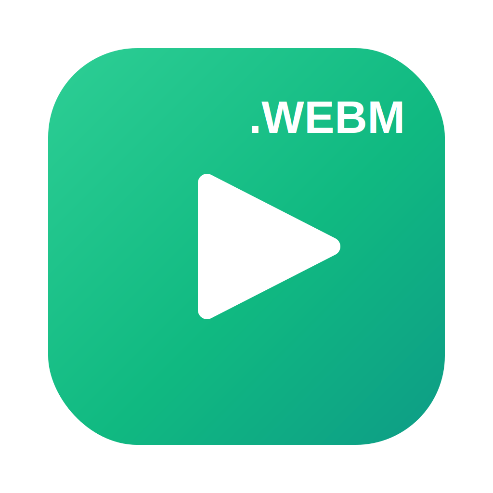

<p align="center">
  
</p>
<h1 align="center">WebM Quick Look</h1>
<p align="center">Native thumbnails, previews, and playback for <code>.webm</code> video on macOS.</p>

---

A macOS app that teaches Finder, Spotlight, and Quick Look to handle WebM
(`.webm`) video — thumbnails in icon/gallery view, a scrubbable preview in the
Quick Look popup and the Finder inline pane, and **fully native playback** in
QuickTime via a MediaExtension.

It ships three extensions bundled in one app:

- **WebM MediaReader** — a native `MEFormatReader` MediaExtension. It demuxes the
  Matroska/WebM container itself and decodes the video and audio in-process with
  vendored libvpx + libvorbis, presenting Motion-JPEG + LPCM so the system's
  built-in decoders play it. This is what makes `.webm` open and play in
  QuickTime Player like any native movie, and fixes Finder's inline-preview
  letterboxing. Covers VP9, VP8, Opus, and Vorbis.
- **WebM Quicklook** — a view-based Quick Look preview extension (WKWebView)
  with custom play/pause, mute, loop, and a draggable scrubber. Used for the
  Space-bar popup and the Finder inline preview pane.
- **WebM Quicklook Thumbnail** — generates first-frame thumbnails for icon and
  gallery views.

## Install

1. Build and install (the script builds all three extensions, signs them, and
   registers them):
   ```sh
   ./install.sh
   ```
   It installs to `/Applications/WebMQuickLook.app`. Keep the app there — macOS
   looks for the extensions inside the app bundle, so moving it may require a
   relaunch.
2. For **native playback**, enable the MediaExtension once:
   **System Settings → General → Login Items & Extensions → Media Extensions →
   WebM MediaReader**. (Quick Look previews and thumbnails work without this; only
   the native QuickTime/Finder movie path needs it.)

## Uninstall

Delete `/Applications/WebMQuickLook.app`. The extensions live inside the bundle
and deregister with it.

## Building from source

The project is a hand-maintained `.xcodeproj`. `install.sh` drives the build:

- The two view-based extensions build unsigned and are signed in place with your
  Apple Development identity.
- The MediaExtension's `com.apple.developer.mediaextension.formatreader`
  entitlement is profile-gated, so it builds with automatic signing
  (`-allowProvisioningUpdates`) — Xcode mints and embeds the provisioning
  profile. An Apple ID for the signing team must be added in Xcode once.

The app icon is generated from SVG: edit `icon/webm-icon.svg` (and the
badge-less `icon/webm-icon-small.svg` for 16/32px), then run `icon/make-icon.sh`
(needs `brew install librsvg`).

## Credits

In-reader decoding uses [libvpx](https://www.webm.project.org/) (VP8/VP9) and
[libvorbis](https://xiph.org/vorbis/) + [libogg](https://xiph.org/ogg/), both
under their respective BSD licenses (retained in `vendor/`). Opus audio is
decoded with the system AudioToolbox.

## License

Released into the public domain (see `LICENSE`). The vendored libvpx / libvorbis
/ libogg retain their own BSD license notices in `vendor/`.
